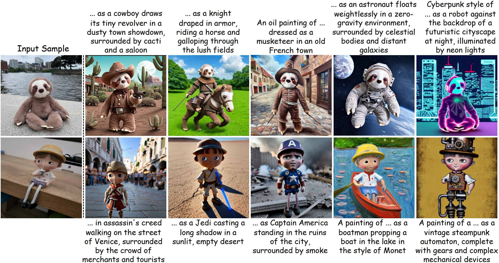
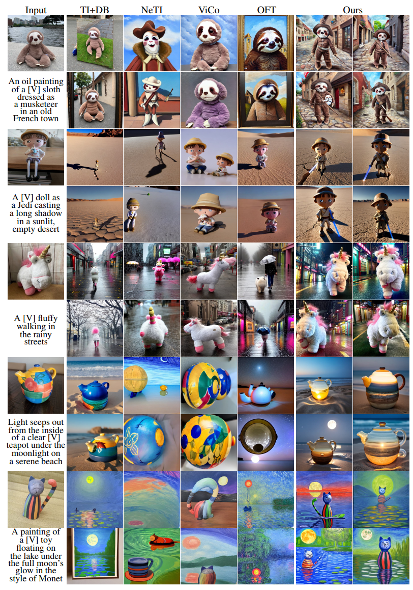

# AttnDreamBooth

Official Implementation of **"AttnDreamBooth: Towards Text-Aligned Personalized Text-to-Image"** by Lianyu Pang, Jian Yin, Baoquan Zhao, Qing Li and Xudong Mao.

## Abstract
>Recent advances in text-to-image models have enabled high-quality personalized image synthesis of user-provided concepts with flexible textual control. In this work, we analyze the limitations of two primary techniques in text-to-image personalization: Textual Inversion and DreamBooth. When integrating the learned concept into new prompts, Textual Inversion tends to overfit the concept, while DreamBooth often overlooks it. We attribute these issues to the incorrect learning of the embedding alignment for the concept. We introduce AttnDreamBooth, a novel approach that addresses these issues by separately learning the embedding alignment, the attention map, and the subject identity in different training stages. We also introduce a cross-attention map regularization term to enhance the learning of the attention map. Our method demonstrates significant improvements in identity preservation and text alignment compared to the baseline methods. Code will be made publicly available.


<!-- <a href="https://arxiv.org/abs/2312.15905"></a> -->

## To Do
1.  - [ ] Release Code
2.  - [ ] Release pre-trained checkpoints

## Download
### Image Dataset
Our datasets were originally collected and are provided by [Textual Inversion](https://github.com/rinongal/textual_inversion) and [DreamBooth](https://github.com/google/dreambooth). You can find all datasets used in our paper from [here](https://drive.google.com/drive/folders/1lLrG95EH3pmwlYkKBRJ_q3mZtI7I1QOo?usp=sharing).

## Results of Our Method




## References

```

```